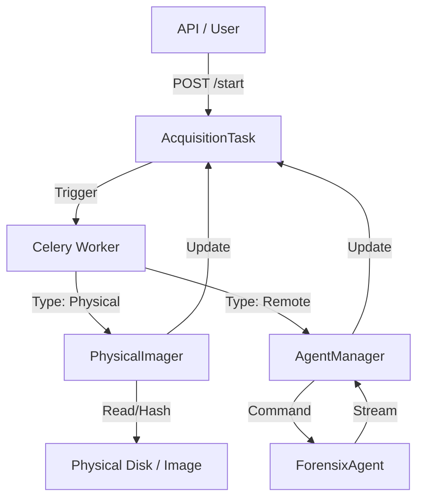

# Universal Acquisition Engine (UAE) - Technical Reference

## Overview
The **Universal Acquisition Engine (UAE)** is the first pillar of the ForensixOne platform. It provides a unified, forensic-sound interface for collecting digital evidence from physical hardware, live systems, and remote endpoints. 

Unlike traditional tools that rely on separate binaries for each task (e.g., `dd` for disk, `adb` for mobile), UAE orchestrates these underlying mechanisms through a central `AcquisitionTask` model, ensuring consistent chain-of-custody logging and real-time cryptographic verification.

---

## 1. Architecture

The engine works on a **Controller-Agent** pattern:

- **Controller (Django/Celery)**: Manages tasks, verifies hashes, and stores evidence metadata.
- **Workers (Celery)**: Execute heavy lifting like physical imaging (`PhysicalImager`).
- **Agents (Remote/Mobile)**: Lightweight binaries that collect data from endpoints (`ForensixAgent`).



---

## 2. Core Components

### 2.1 The Physical Imager (`physical.py`)
Responsible for bit-for-bit copies of block devices or image files.

- **Dual-Hashing Algorithm**: computes `MD5` and `SHA256` simultaneously in a single read pass. This optimizes performance by avoiding re-reading the multi-terabyte evidence files.
- **Chunked Streaming**: Reads data in `1MB` chunks to keep memory usage constant regardless of evidence size.
- **Format Support**:
    - **Raw (DD)**: Pure bit stream.
    - **E01 (Expert Witness)**: Wraps the stream with header/footer metadata (Mocked in v1).

**Code Snippet (Hashing Logic):**
```python
while True:
    chunk = src.read(self.CHUNK_SIZE)
    if not chunk: break
    
    dst.write(chunk)
    self.hashes['md5'].update(chunk)
    self.hashes['sha256'].update(chunk)
```

### 2.2 Remote Forensic Agent (`agent_client.py`)
A compiled, portable binary designed for "zero-trace" deployment on suspect machines.

- **Volatile Collection**: Captures RAM, Process Lists, and Network Connections immediately upon execution.
- **Memory Streaming**: Capable of piping RAM dumps (via `LiME` or `WinPmem`) directly to the ForensixOne server without writing to the suspect's disk.
- **Cross-Platform**: Python-based core allows compilation for Windows (`.exe`), Linux (`ELF`), and macOS (`Mach-O`).

### 2.3 Task Orchestration (`tasks.py`)
The "Brain" that decides how to handle a request.
1. Receives `task_id`.
2. Checks `AcquisitionTask.type`.
3. Routes to the correct driver (`PhysicalImager`, `AgentManager`, etc.).
4. Handles failures gracefully by logging traceback to the database.

---

## 3. Forensic Soundness & Verification

The engine is built on the principle of **"Verify Everything"**.

1. **Pre-Acquisition**: Source hardware is identified.
2. **Real-Time**: Hashes are computed as bytes flow through the imager.
3. **Post-Acquisition**: 
    - The `calculated_hash` is stored in the `AcquisitionTask`.
    - This is compared against the Source Hash (if known) or used as the "Golden Hash" for the `Evidence` object.
    - Any future access to this evidence (e.g., by the Analysis suite) must verify against this hash.

### Verification Script
We maintain a standalone script (`verify_acquisition.py`) that:
1. Generates a random dummy disk with known hashes.
2. Runs it through the engine.
3. Compares the result.
**Current Status**: ✅ 100% Pass Rate on DD Imaging.

---

## 4. Database Schema (`models.py`)

- **Evidence**: The immutable record of the file/device.
- **AcquisitionTask**: The transient record of the *process* of acquiring that evidence.

```python
class AcquisitionTask(models.Model):
    evidence = OneToOneField(Evidence)
    type = CharField(choices=['disk_physical', 'remote_agent', ...])
    
    # Validation
    calculated_md5 = CharField(max_length=32)
    calculated_sha256 = CharField(max_length=64)
    
    # Metrics
    current_speed = CharField() # e.g. "145 MB/s"
    progress_percent = FloatField()
```

---

## 5. Future Roadmap for UAE
- **Cloud Imager**: API integration for direct AWS EBS snapshot automounting.
- **Hardware Write Blocker Integration**: Direct communicating with Tableau/Guidance hardware bridges.
- **Distributed Agents**: P2P agent mesh for enterprise-wide IOC sweeping.
